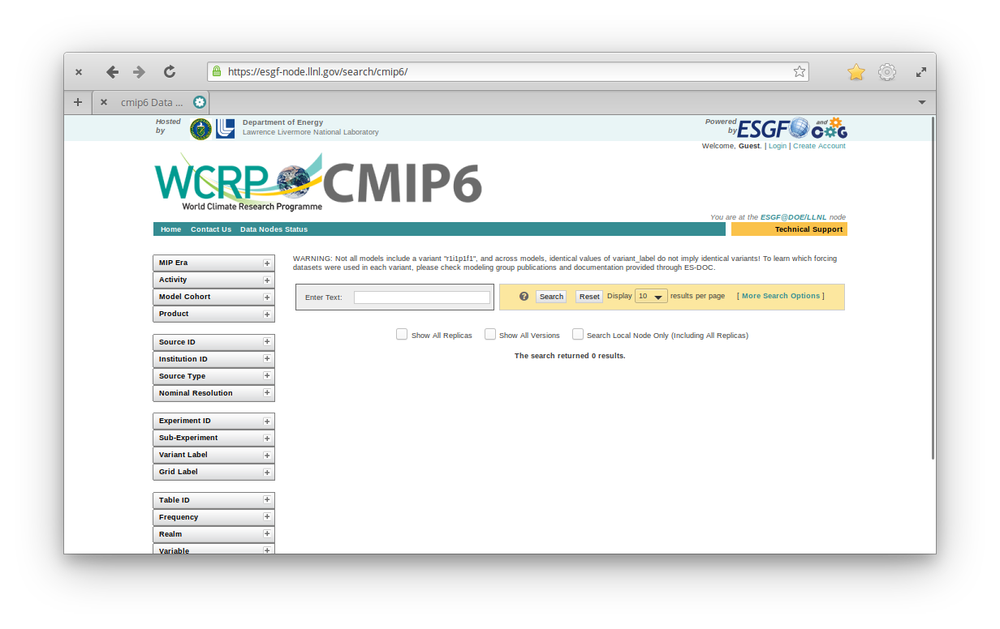
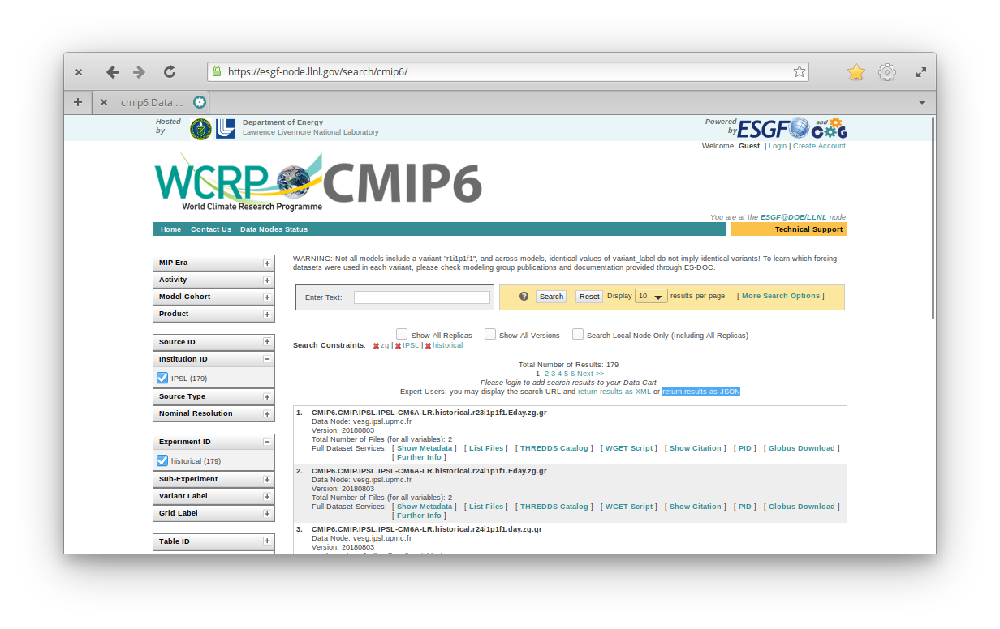
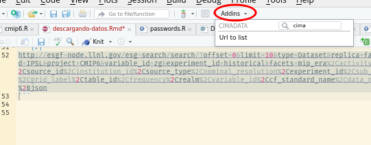

```{r, include = FALSE}
knitr::opts_chunk$set(
  collapse = TRUE,
  comment = "#>"
)
```

```{r setup}
library(cimadata)
```

# Buscando datos

Lo primero es ir a https://esgf-node.llnl.gov/search/cmip6/ donde nos encontramos con algo así

```{r, out.width="100%"}

```

En esa página, realizamos una búsqueda utilizando los filtros de la izquierda. Por ejemplo, podemos buscar datos producidos por el IPSL, para las corridas históricas y nos interesa la variable "zg" (geopotencial). 

```{r, out.width="100%"}

```

Debajo de la cantidad de resultados hay un link que dice "return results as JSON". Si hacemos click derecho -> copiar link, obtenemos esto:

"http://esgf-node.llnl.gov/esg-search/search/?offset=0&limit=10&type=Dataset&replica=false&latest=true&institution_id=IPSL&project=CMIP6&variable_id=zg&experiment_id=historical&facets=mip_era%2Cactivity_id%2Cmodel_cohort%2Cproduct%2Csource_id%2Cinstitution_id%2Csource_type%2Cnominal_resolution%2Cexperiment_id%2Csub_experiment_id%2Cvariant_label%2Cgrid_label%2Ctable_id%2Cfrequency%2Crealm%2Cvariable_id%2Ccf_standard_name%2Cdata_node&format=application%2Fsolr%2Bjson"

Que si se pasa por `cmip_url_to_list()` nos da una lista interpretable y modificable. 


```{r}
cmip_url_to_list("http://esgf-node.llnl.gov/esg-search/search/?offset=0&limit=10&type=Dataset&replica=false&latest=true&institution_id=IPSL&project=CMIP6&variable_id=zg&experiment_id=historical&facets=mip_era%2Cactivity_id%2Cmodel_cohort%2Cproduct%2Csource_id%2Cinstitution_id%2Csource_type%2Cnominal_resolution%2Cexperiment_id%2Csub_experiment_id%2Cvariant_label%2Cgrid_label%2Ctable_id%2Cfrequency%2Crealm%2Cvariable_id%2Ccf_standard_name%2Cdata_node&format=application%2Fsolr%2Bjson")
```

Para hacer esto más fácil, se puede seleccionar la url y usar el Addin "Url to list" para que nos pegue el código necesario y prolijo. 

```{r, out.width="100%"}

```

Que devuelve este código:

```{r}
query <- list(
  type           = "Dataset",
  replica        = "false",
  latest         = "true",
  institution_id = "IPSL",
  project        = "CMIP6",
  variable_id    = "zg",
  experiment_id  = "historical"
)
```


Ahora podemos usar esta lista como base para agregarle más variables, otras instituciones u otros modelos. Para ver qué datos hay, pasamos esa query a `cmip_search()`. El resultado es una lista enorme, pero con `as.data.frame()` lo podemos convertir en una tabla.

```{r}
resultado <- cmip_search(query)

resultado_df <- as.data.frame(resultado)
head(resultado_df)
```

Acá podemos usar `resultado_df` para seleccionar y filtrar los modelos que realmente queremos bajar, y luego refinar la búsqueda o simplemente hacer un subset en los elementos de `resultado`. 

# Descargando datos

Para bajar los resultados, primero es más cómodo setear globalmente el directorio donde vamos a alojar nuestros datos:

```{r}
cmip_folder_set("~/DATOS/CMIP6")
```

Y luego bajar con `cmip_download()`

```{r eval=FALSE}
archivos <- cmip_download(resultado)
```

Con esto obtenemos los datos "crudos", que pueden incluir archivos separados para distintos intervalos de tiempo y cada miembro de un ensamble. Para consolidar esos datos en un solo archivo cada uno, hay que hacer un último paso:

```{r, eval = FALSE}
cmip_consolidate(archivos)
```

Y listo! En ~/DATOS/CMIP6 vas a tener la estructura de datos listo para ser usada. 

# Leyendo datos

Para listar los archivos dispoibles en una determinada carpeta (por default, la seteada con `cmip_folder_set()`) hay que usar

```{r}
datos <- cmip_available()
datos
```

Ahí se obtiene una tabla con los distintos experimentos, modelos, variable, etc... descargados y consolidados junto con el archivo. Si uno estuviera interesado en los modelos del IPSL, eligiría esos dos: 

```{r}
archivo <- datos[3 ]$file
```


Y ahora sólo queda leer los datos con la herramienta que uno prefiera. Por ejemplo

```{r, eval = FALSE}
datos <- metR::ReadNetCDF(archivo)
```

